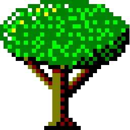

# LinkDir
<b>MobCat's Link Directory Classifieds</b> 
[Live Demo](https://www.mobcat.zip/linkdir)

A very simple almost code free system for hosting lists of links

# Pre-requirements
A webhost that let's you place arbitrary files on it. 
PHP 8.2.12 or newer 
SQLite 3.39.2 or newer 
[DB Browser for SQLite](https://sqlitebrowser.org/) 

# Quick Setup
1. Simply download the latest build from [here](https://github.com/MobCat/LinkDir/releases/download/mian/linkdir_20240809.zip) 
2. Extract it into a folder for eg. `linkdir/index.php` 
(Make sure the `.htaccess` is in the root of the folder, otherwise people will be able to freely download your `links.db`
3. Edit the `links.db` with DB Browser or your desired sqlite editor to setup your own link lists 
(A totally blank db can be found [here](links.db) if you want to start 100% fresh, however this db will crash the website, as it contains NO data.) 
4. Remember to download and setup your [favicons](https://onlineminitools.com/website-favicon-downloader) and category gifs and place them in the `icons` folder 
5. Then upload your whole linkdir folder to your webhost 
Any further changes you would like to make to your links can be done by simply editing the `links.db` and reuploading it to your webhost 
A full and in-depth setup guide can be found at [SETUP.md](SETUP.md) 
A full customization guide can be found at [CUSTOMIZE.md](CUSTOMIZE.md) 

# FAQ
<i>Why do we have to download and setup the website icons our selves?</i> 
Security, stability, consistency and customizey. 
Yes, these are your friends websites, but generally it's not a good idea or best practice to just blindly live import assets from external websites 
(see Cross-site scripting (XSS) or supply chain attacks for more info) 
So we download and setup our own icons as detailed in [SETUP.md](SETUP.md)  
so we can change or customize them if we want, or to suit the theme of your website. 
And we don't have to worry about the asset going missing or changing outside of our control.
